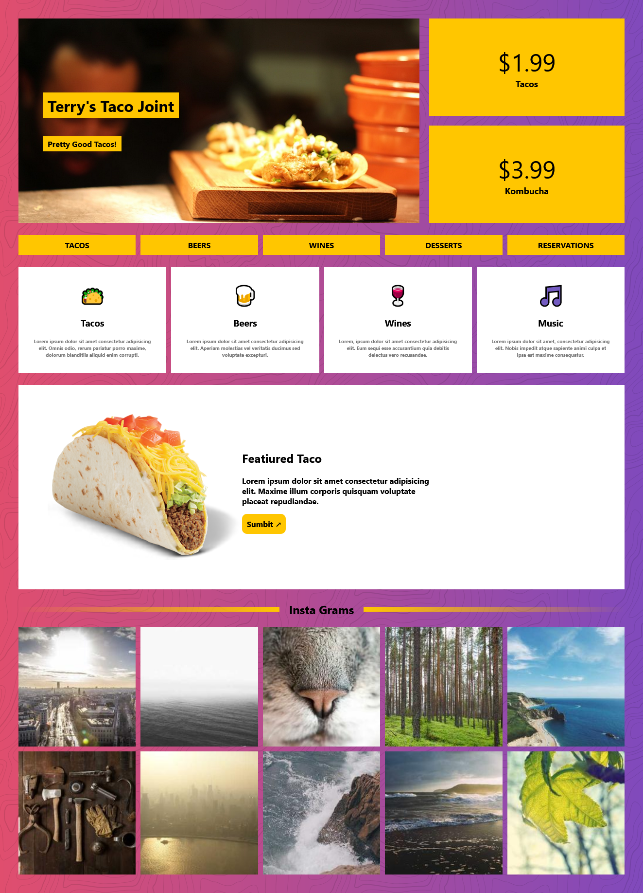

# Taco Joint - Landing Page

Bienvenido a **Taco Joint**, una landing page moderna y colorida creada para practicar **HTML** y **CSS**. Este proyecto simula la página principal de un restaurante de tacos, mostrando su menú, especialidades, precios y una galería de imágenes estilo Instagram.

## 🌮 Características

- Diseño vibrante y atractivo con colores llamativos.
- Secciones destacadas para menú: tacos, cervezas, vinos, postres y reservas.
- Precios destacados para productos principales.
- Zona de especialidad del día con llamada a la acción.
- Galería de imágenes tipo Instagram para mostrar ambiente y productos.
- Iconografía personalizada y menús intuitivos.

## 🛠️ Tecnologías utilizadas

- **HTML5** para la estructura semántica.
- **CSS3** para el diseño y estilo visual.

## 📚 Propósito del proyecto

La idea de este sitio es practicar el diseño web y el uso de estilos CSS, enfocado en la creación de interfaces atractivas y funcionales, ideal para quienes desean mejorar sus habilidades front-end.

---

**¡Gracias por visitar este proyecto! Espero que te inspire a crear experiencias web únicas y divertidas.**
